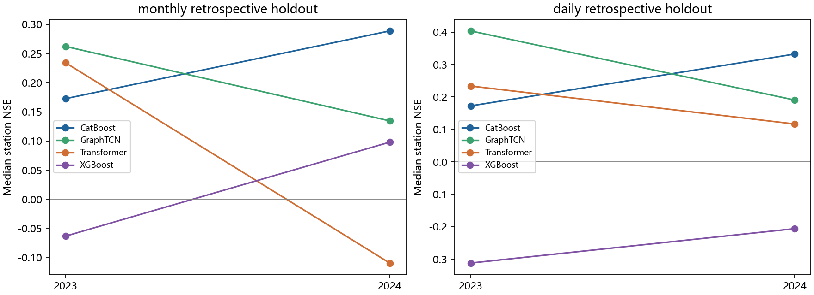

> 公开审阅副本：科学正文保留；大表链接指向完整分片，私有逐日曲线和旧实验链接标注为未公开。原报告与本副本哈希见发布清单。

# 专家机器学习与全域验证报告

20260930_1；最终证据解释版。审查对象是冻结设计下的回顾性时间与空间验证，NH₄/DO全部排除。

## 结论

独立外部驱动已经支持一部分TN变化：按内部验证冻结的CatBoost三种子预测均值，2023／2024官方月NSE中位数为0.1726／0.2887，HF日NSE为0.1725／0.3325，月内NSE为0.1674／0.2092。它明显优于本轮简单流量—季节参照，但未恢复完整波形。月内幅度仅为观测的0.3500／0.4477，月内相关为0.4172／0.4812。

联合GraphTCN在2023日NSE达到0.4037，2024却降至0.1906；相对直接CatBoost的逐站配对日NSE差为+0.0195／−0.1419，改善站比例53.3%／26.7%。2023总体中位数之差+0.2312不能代替逐站差中位数+0.0195。未见支流表现也不一致：B113的Graph日NSE为0.5819／0.4735，B56和B191仍为负。复杂算法与联合目标没有形成跨折、跨区域一致收益。

历史TN在短提前量提供额外状态信息，但须与持续性同可见性比较：提前1日学习模型2023／2024日NSE为0.4639／0.6055，持续性为0.6922／0.4931。2023学习模型反而较差；年度闭环移除评价年反馈后，优势明显改变。因此不能把反馈成绩认证为独立源预测能力，也不能据此次ML表现判定D29某一个库存或输运过程是唯一主因。

本轮有限矩阵已全部完成并通过独立读数、预测、指标和协议核查；这确认计算结果可复核。神经网络和树多数按固定迭代／epoch终止，没有数学最优性证书。模型表现、求解限制、输入/水量限制及迁移限制在下文分别回答。

## 1. 实际完成范围与身份

200个有效筛选身份（11族×2直接任务×8配置=176，另3条联合路线×8=24），189条正式逻辑路径缺项0。45条S24合法复用对应S23检查点，只作新年度读出，不重复拟合；因此189不能说成189次独立训练。另有53个参照身份。角色台账共584个目录身份，包含被替代、延后和失败；其中42个记录失败，不进入有效正式结果，但没有从台账抹去。当前根jobs的466个result.json均为complete，不代表全部历史尝试从未失败。详见[全部角色与尝试](../outputs/result_roles.json)及[停止状态表](../outputs/expert_review/training_attempts_summary.csv)。

F23在2016—2022月报／2021—2022HF上重新训练、2023评价；F24训练至2023、2024评价。配置仅由截至2021训练和2022年1—9月内部验证选定，2022年10—12月用于非负凸集成。直接月CatBoost c2、直接日CatBoost c4；联合XGBoost c3、Transformer c3、GraphTCN c7。三种子先逐日／逐月平均预测，再计算NSE，不能平均三份NSE替代。

S23是允许区域截至2023训练后的2023同年未见支流检验；S24使用同一检查点评价2024。留出块及下游影响缓冲站的所有年份标签均移除。空间采用预登记c0和网络120epoch；技术家族仍由全域内部验证确定，因此是固定家族条件下的标签区域留出，不是全新河网迁移或完全盲目的算法发现。另保留同c0全域参照，S23全域参照是训练重建，不能叫留出预测。路径中的任务、配置、种子、支流和读出后缀详见[模型路径与观测支持说明](模型路径与观测支持说明.md)。

## 2. 观测、输入和统计支持

月报8629行、116站，2016—2020逐年64/71/65/65/65站，2021—2024每年116站非空；每年116站不等于116×12条完整站月。2023有1090条、2024有1138条月报。HF只有15站身份通过，未以最近距离自动扩站。230河段均有模型读出，但没有230个实测站。

HF去重原始TN59013条，eligible原始读数56643条，合格9716个日均实际包含51199条读数；三者不是同一人口。见[读数支持身份](../evidence/HF_support_count_identity.json)、[独立日均复算](../evidence/independent_HF_reading_mean.json)及[全站逐年支持](../outputs/coverage/station_year_support.csv)。重复读数不增加信息，月报不复制成日标签。2021年度HF不足注册覆盖，年度NSE明确不可定义；跨2021—2022整体支持可定义。

月报采用用户确认的自动监测有效读数算术均值。不能取得完整官方读数次数时，联合日模型和全日历读出用等日近似；HF支持月均按实际合格日读数次数。monthly与hf_monthly分别评价。日NSE以共同有效日等权；月内NSE对每月按读数次数分别去观测／预测均值，再以月份等权累计平方误差和观测方差。年度日覆盖至少30日且跨3月，月值至少8个；零观测方差不加epsilon。每折官方月结果均有116站行，但合格NSE分别只有78、85站，其他站保留原因。

冻结H1从1961演化，ML从2015暖机取得90／180／365日序列及过去驱动滚动统计，不是从1961递推一个氮库存。137列加站界水量／沿程比例为139个输入，另有缺失掩码。年度农业、LUH3、MOD17和当月沉降是预测期已知条件的回顾性产品；年产品不是日排放。MOD17只是碳生产协变量；沉降是非水面月暴露，不是按雨分配的每日真实负荷，包含少量未知地类产品暴露（2015—2024约0.03%）。缺项只按训练资料插补并保留掩码，不插补TN。

主线无灰箱预测、氮库存、拟合源倍率、反推输入或站号编码。Graph额外读上游一跳驱动视图，并非与普通树完全同输入；静态土地/土壤/地形仍能识别地理差异，所以无站号不等于未见地理域泛化已解决。H1水量独立复算与冻结实现一致，不认证同站界实测水量准确。

## 3. 文献如何影响本轮设计

去重筛查143条，详细核查18个研究与9个公开实现共27项；2篇全文、16项摘要，其余为公开实现／文档。不把27项说成25篇全文。未知的样本数或切分规则在[文献证据表](../literature/detailed_evidence_table.csv)中保持未知；检索题录不是全文证据。

[LSTM水质综述](https://doi.org/10.1016/j.wroa.2023.100207)支持序列、卷积及注意力比较，但不同提前量、输入与评价支持没有公共高分保证。[Fang等2024](https://doi.org/10.3389/frwa.2024.1456647)的大样本LSTM与WRTDS比较提示增加气象和复杂度未必普遍胜出，故保留流量—季节岭回归。[Pandit等2025](https://doi.org/10.1029/2024WR039207)提示时间与空间技能不同，其摘要时间／空间0.60／0.18是KGE，不是NSE。[东江TN高分案例](https://doi.org/10.3390/w17081131)依赖其他水质变量，不能作为本轮独立驱动的预期精度。本轮保留物理有向图，不用评价TN相关性构图；历史TN另设严格可见性任务，不借NH₄／DO取得同期代理。

## 4. 全部技术路线的时间结果

以下是每族内部选定配置seed1729的NSE中位数，所有算法按同类标签支持比较；不是按评价年重新排名选模型。月尺度78／85站、日15／15站。完整RMSE、偏差、相关、幅度和逐站NSE在[配置汇总](../outputs/expert_review/configuration_summary.csv)及[完整逐站指标](../outputs/evaluation/all_station_metrics/INDEX.md)。

| 路线 | F23_monthly | F24_monthly | F23_daily | F24_daily |
| --- | --- | --- | --- | --- |
| RF | 0.0289 | 0.0963 | -0.0165 | 0.3006 |
| ExtraTrees | 0.0794 | 0.0223 | 0.1300 | 0.2393 |
| XGBoost | 0.0644 | 0.2684 | 0.1178 | 0.2795 |
| LightGBM | 0.2137 | 0.2703 | 0.1176 | 0.2559 |
| CatBoost | 0.1841 | 0.3130 | 0.1698 | 0.3226 |
| MLP | 0.0348 | -0.0762 | 0.2248 | 0.2644 |
| LSTM | -0.0041 | -0.0587 | 0.3773 | 0.1226 |
| GRU | 0.2411 | 0.1828 | 0.1857 | 0.2096 |
| TCN | 0.0036 | -0.1135 | 0.2977 | 0.2671 |
| Transformer | 0.0499 | 0.0558 | 0.2131 | 0.1460 |
| GraphTCN | -0.0809 | 0.1372 | 0.1974 | 0.2374 |
| ridge | -1.9210 | -2.4353 | -0.4470 | -0.8826 |
| seasonal | -2.1685 | -2.9324 | -1.0739 | -1.4547 |
| convex_ensemble | 0.1987 | 0.2881 | 0.2977 | 0.2671 |

LSTM单种子2023日NSE0.3773而2024仅0.1226；不能看2023后把它替换成主路线。直接月GRU也有2023较好、2024转弱。较简单的提升树在2024更稳，模型复杂度没有单调收益。内部冻结的日凸集成权重几乎全落在TCN（权重1），其成绩0.2977／0.2671实质是该TCN，不称多算法互补改善。月凸集成主要Transformer0.402、LightGBM0.309、CatBoost0.125等，NSE0.1987／0.2881；不能忽略第三季度与第四季度内部支持差异。

## 5. 三种子主结果及共同支持比较

下表所有值是合格NSE站的指标中位数，RMSE和偏差单位mg/L，幅度比为预测标准差／观测标准差；月内NSE对月支持不适用。中位数不能代表所有站或汇总池化NSE。

| 配置 | 时期 | 支持 | 合格站 | NSE | 月内NSE | RMSE | 偏差 | 相关 | 幅度比 |
| --- | --- | --- | --- | --- | --- | --- | --- | --- | --- |
| F23_monthly_CatBoost_c2_seedmean | F23 | monthly | 78 | 0.1726 | 不可定义／不适用 | 0.4016 | -0.0242 | 0.7925 | 0.5363 |
| F23_daily_CatBoost_c4_seedmean | F23 | daily | 15 | 0.1725 | 0.1674 | 0.6274 | 0.0367 | 0.5877 | 0.5265 |
| joint_F23_XGBoost_c3_seedmean | F23 | monthly | 78 | -0.0632 | 不可定义／不适用 | 0.4188 | -0.0394 | 0.6722 | 0.5237 |
| joint_F23_XGBoost_c3_seedmean | F23 | daily | 15 | -0.3122 | 0.1014 | 0.6629 | -0.0508 | 0.5635 | 0.4204 |
| joint_F23_Transformer_c3_seedmean | F23 | monthly | 78 | 0.2340 | 不可定义／不适用 | 0.3952 | 0.0267 | 0.7644 | 0.6658 |
| joint_F23_Transformer_c3_seedmean | F23 | daily | 15 | 0.2339 | 0.1891 | 0.5671 | 0.1357 | 0.7623 | 0.5050 |
| joint_F23_GraphTCN_c7_seedmean | F23 | monthly | 78 | 0.2621 | 不可定义／不适用 | 0.3923 | -0.0302 | 0.7952 | 0.6608 |
| joint_F23_GraphTCN_c7_seedmean | F23 | daily | 15 | 0.4037 | 0.2157 | 0.5626 | 0.0444 | 0.7618 | 0.5882 |
| F24_monthly_CatBoost_c2_seedmean | F24 | monthly | 85 | 0.2887 | 不可定义／不适用 | 0.3634 | -0.0967 | 0.7353 | 0.5811 |
| F24_daily_CatBoost_c4_seedmean | F24 | daily | 15 | 0.3325 | 0.2092 | 0.4216 | 0.0468 | 0.7071 | 0.6342 |
| joint_F24_XGBoost_c3_seedmean | F24 | monthly | 85 | 0.0980 | 不可定义／不适用 | 0.4137 | -0.1525 | 0.7575 | 0.5959 |
| joint_F24_XGBoost_c3_seedmean | F24 | daily | 15 | -0.2063 | 0.1202 | 0.7510 | -0.1680 | 0.6122 | 0.4604 |
| joint_F24_Transformer_c3_seedmean | F24 | monthly | 85 | -0.1094 | 不可定义／不适用 | 0.4116 | -0.2578 | 0.7441 | 0.5579 |
| joint_F24_Transformer_c3_seedmean | F24 | daily | 15 | 0.1168 | 0.1900 | 0.5341 | -0.0817 | 0.6269 | 0.3953 |
| joint_F24_GraphTCN_c7_seedmean | F24 | monthly | 85 | 0.1345 | 不可定义／不适用 | 0.3724 | -0.1288 | 0.7744 | 0.6412 |
| joint_F24_GraphTCN_c7_seedmean | F24 | daily | 15 | 0.1906 | 0.2098 | 0.4971 | -0.0665 | 0.7258 | 0.5556 |

联合目标为0.8D官方月报+0.2D HF月内异常+R，两项D均为半加权标准化平方误差，实际平方系数0.4／0.1。HF不加载第二份月水平。这个设计给月报多数支持较强约束；HF的绝对水平可能仍与官方月表/区域背景不一致。联合XGBoost的日训练NSE也为负而月训练NSE很高，说明此次联合配置对两块数据没有同时满足，不能把其日劣势直接等同“树不能表达波形”。它使用的聚合梯度已核验，Gauss–Newton对角上界是明确近似；当前证据不证明求解已到最优，也不支持评价后改权重重选本轮结果。

| 时期 | 支持 | 基准 | 候选 | 共同站 | 基准NSE | 候选NSE | 总体中位数差 | 逐站差中位数 | 改善比例 | 月内逐站差中位数 |
| --- | --- | --- | --- | --- | --- | --- | --- | --- | --- | --- |
| F23 | daily | F23_daily_CatBoost_c4_seedmean | joint_F23_GraphTCN_c7_seedmean | 15 | 0.1725 | 0.4037 | 0.2312 | 0.0195 | 0.5333 | 0.0207 |
| F23 | daily | F23_daily_CatBoost_c4_seedmean | joint_F23_Transformer_c3_seedmean | 15 | 0.1725 | 0.2339 | 0.0613 | 0.0918 | 0.5333 | 0.0068 |
| F23 | daily | F23_daily_CatBoost_c4_seedmean | joint_F23_XGBoost_c3_seedmean | 15 | 0.1725 | -0.3122 | -0.4847 | -0.4832 | 0.2000 | -0.0660 |
| F23 | monthly | F23_monthly_CatBoost_c2_seedmean | joint_F23_GraphTCN_c7_seedmean | 78 | 0.1726 | 0.2621 | 0.0895 | 0.0632 | 0.5897 | 不可定义／不适用 |
| F23 | monthly | F23_monthly_CatBoost_c2_seedmean | joint_F23_Transformer_c3_seedmean | 78 | 0.1726 | 0.2340 | 0.0614 | -0.0419 | 0.4872 | 不可定义／不适用 |
| F23 | monthly | F23_monthly_CatBoost_c2_seedmean | joint_F23_XGBoost_c3_seedmean | 78 | 0.1726 | -0.0632 | -0.2358 | -0.0347 | 0.4359 | 不可定义／不适用 |
| F24 | daily | F24_daily_CatBoost_c4_seedmean | joint_F24_GraphTCN_c7_seedmean | 15 | 0.3325 | 0.1906 | -0.1419 | -0.1419 | 0.2667 | -0.0170 |
| F24 | daily | F24_daily_CatBoost_c4_seedmean | joint_F24_Transformer_c3_seedmean | 15 | 0.3325 | 0.1168 | -0.2157 | -0.3066 | 0.2667 | 0.0174 |
| F24 | daily | F24_daily_CatBoost_c4_seedmean | joint_F24_XGBoost_c3_seedmean | 15 | 0.3325 | -0.2063 | -0.5387 | -0.4947 | 0.0667 | -0.0766 |
| F24 | monthly | F24_monthly_CatBoost_c2_seedmean | joint_F24_GraphTCN_c7_seedmean | 85 | 0.2887 | 0.1345 | -0.1543 | -0.0595 | 0.4118 | 不可定义／不适用 |
| F24 | monthly | F24_monthly_CatBoost_c2_seedmean | joint_F24_Transformer_c3_seedmean | 85 | 0.2887 | -0.1094 | -0.3981 | -0.2177 | 0.2824 | 不可定义／不适用 |
| F24 | monthly | F24_monthly_CatBoost_c2_seedmean | joint_F24_XGBoost_c3_seedmean | 85 | 0.2887 | 0.0980 | -0.1907 | -0.0589 | 0.4000 | 不可定义／不适用 |

同支持逐站差、总体中位数差和改善比例必须同时看。2023联合Graph的日总体差+0.2312，逐站差只有+0.0195；2024日两种差均−0.1419。月内配对差+0.0207／−0.0170，联合带来的增益没有同时通过两折动态要求。

仅用15站HF训练的直接日CatBoost，向全部认证站的全日历外推后聚合官方月报，2023／2024月NSE为−0.7030／−0.4576。它的15站日成绩为正，不能代替116站的月空间覆盖；也不能把这个日聚合值与按真实HF读数聚合的hf_monthly混为一项。[完整日聚合指标](../outputs/expert_review/configuration_summary.csv)和对应dailyagg共同支持配对均保留。月报确实为全域水平提供独立信息，但本轮联合与直接路线同时改变目标和算法，未做唯一因素的“增加月报”因果检验。

## 6. 月块抽样与不确定性

所有1202个注册比较都有seed1729的1000次同步整月与连续两月块抽样，共2404个抽样表；站点不独立重采样。区间是回顾性有限月份的百分位描述，不能解释成来自新年份的严格置信保证，也不能据区间挑选配置。站点在原共同合格支持冻结，抽样后零方差仍不可定义。

| 时期 | 支持 | 候选 | 块长（月） | 逐站差区间下限 | 逐站差区间上限 | 月内差区间下限 | 月内差区间上限 |
| --- | --- | --- | --- | --- | --- | --- | --- |
| F23 | daily | joint_F23_GraphTCN_c7_seedmean | 1 | -0.0816 | 0.3576 | -0.0794 | 0.1314 |
| F23 | daily | joint_F23_GraphTCN_c7_seedmean | 2 | -0.0982 | 0.3826 | -0.0902 | 0.1425 |
| F23 | daily | joint_F23_Transformer_c3_seedmean | 1 | -0.0169 | 0.1671 | -0.0631 | 0.1061 |
| F23 | daily | joint_F23_Transformer_c3_seedmean | 2 | -0.0194 | 0.1685 | -0.0607 | 0.1001 |
| F23 | daily | joint_F23_XGBoost_c3_seedmean | 1 | -0.7753 | -0.0717 | -0.1606 | 0.0365 |
| F23 | daily | joint_F23_XGBoost_c3_seedmean | 2 | -0.8786 | -0.0922 | -0.1731 | 0.0278 |
| F23 | monthly | joint_F23_GraphTCN_c7_seedmean | 1 | -0.0210 | 0.1115 | 不可定义／不适用 | 不可定义／不适用 |
| F23 | monthly | joint_F23_GraphTCN_c7_seedmean | 2 | -0.0179 | 0.1302 | 不可定义／不适用 | 不可定义／不适用 |
| F23 | monthly | joint_F23_Transformer_c3_seedmean | 1 | -0.1069 | 0.0569 | 不可定义／不适用 | 不可定义／不适用 |
| F23 | monthly | joint_F23_Transformer_c3_seedmean | 2 | -0.1111 | 0.0517 | 不可定义／不适用 | 不可定义／不适用 |
| F23 | monthly | joint_F23_XGBoost_c3_seedmean | 1 | -0.1282 | 0.0036 | 不可定义／不适用 | 不可定义／不适用 |
| F23 | monthly | joint_F23_XGBoost_c3_seedmean | 2 | -0.1546 | 0.0015 | 不可定义／不适用 | 不可定义／不适用 |
| F24 | daily | joint_F24_GraphTCN_c7_seedmean | 1 | -0.2948 | -0.0209 | -0.1022 | 0.0675 |
| F24 | daily | joint_F24_GraphTCN_c7_seedmean | 2 | -0.3648 | -0.0355 | -0.1184 | 0.0485 |
| F24 | daily | joint_F24_Transformer_c3_seedmean | 1 | -0.4897 | -0.0951 | -0.0928 | 0.0721 |
| F24 | daily | joint_F24_Transformer_c3_seedmean | 2 | -0.5547 | -0.1297 | -0.0629 | 0.0720 |
| F24 | daily | joint_F24_XGBoost_c3_seedmean | 1 | -0.8360 | -0.3144 | -0.1676 | 0.0180 |
| F24 | daily | joint_F24_XGBoost_c3_seedmean | 2 | -1.1050 | -0.3223 | -0.1472 | 0.0222 |
| F24 | monthly | joint_F24_GraphTCN_c7_seedmean | 1 | -0.1395 | 0.0042 | 不可定义／不适用 | 不可定义／不适用 |
| F24 | monthly | joint_F24_GraphTCN_c7_seedmean | 2 | -0.1601 | 0.0163 | 不可定义／不适用 | 不可定义／不适用 |
| F24 | monthly | joint_F24_Transformer_c3_seedmean | 1 | -0.3703 | -0.1437 | 不可定义／不适用 | 不可定义／不适用 |
| F24 | monthly | joint_F24_Transformer_c3_seedmean | 2 | -0.4630 | -0.1351 | 不可定义／不适用 | 不可定义／不适用 |
| F24 | monthly | joint_F24_XGBoost_c3_seedmean | 1 | -0.1696 | -0.0132 | 不可定义／不适用 | 不可定义／不适用 |
| F24 | monthly | joint_F24_XGBoost_c3_seedmean | 2 | -0.2095 | -0.0328 | 不可定义／不适用 | 不可定义／不适用 |

2023Graph日逐站差的两种区间都跨零；2024两种区间都为负（约[−0.295,−0.021]及[−0.365,−0.035]）。月内差的区间仍跨零。不能只引用正的点估计证明普遍改善。所有配置、两种NSE口径、改善比例及定义抽样数的区间见[完整配对抽样汇总](../outputs/expert_review/paired_uncertainty_summary/INDEX.md)。

## 7. 训练重建与留出差距

训练期不是留出成绩。以下是实际三种子预测均值重算的完整训练支持；月116站与年度评价78／85站人口不同，不能直接把两个中位数相减解释为逐站泛化损失。逐站、逐年及原单种子训练曲线均保留。

| 配置 | 支持 | 训练期 | 合格站 | NSE | 月内NSE | RMSE | 偏差 | 相关 | 幅度比 |
| --- | --- | --- | --- | --- | --- | --- | --- | --- | --- |
| F23_daily_CatBoost_c4_seedmean | daily | 2021—2022 | 15 | 0.8349 | 0.6707 | 0.2574 | 0.0012 | 0.9274 | 0.7741 |
| F23_monthly_CatBoost_c2_seedmean | monthly | 2016—2022 | 116 | 0.7601 | 不可定义／不适用 | 0.2114 | -0.0007 | 0.8998 | 0.6666 |
| F24_daily_CatBoost_c4_seedmean | daily | 2021—2023 | 15 | 0.8841 | 0.7092 | 0.2395 | 0.0010 | 0.9474 | 0.8362 |
| F24_monthly_CatBoost_c2_seedmean | monthly | 2016—2023 | 116 | 0.7270 | 不可定义／不适用 | 0.2294 | 0.0010 | 0.8876 | 0.6546 |
| joint_F23_GraphTCN_c7_seedmean | daily | 2021—2022 | 15 | 0.4639 | 0.6178 | 0.4126 | 0.0533 | 0.7959 | 0.6457 |
| joint_F23_GraphTCN_c7_seedmean | monthly | 2016—2022 | 116 | 0.4706 | 不可定义／不适用 | 0.2902 | 0.0084 | 0.7173 | 0.5731 |
| joint_F23_Transformer_c3_seedmean | daily | 2021—2022 | 15 | 0.2313 | 0.2710 | 0.4395 | 0.1560 | 0.6738 | 0.4837 |
| joint_F23_Transformer_c3_seedmean | monthly | 2016—2022 | 116 | 0.2533 | 不可定义／不适用 | 0.3623 | 0.0806 | 0.6178 | 0.5380 |
| joint_F23_XGBoost_c3_seedmean | daily | 2021—2022 | 15 | -0.5632 | 0.9337 | 0.5147 | -0.4587 | 0.7301 | 0.6115 |
| joint_F23_XGBoost_c3_seedmean | monthly | 2016—2022 | 116 | 0.9740 | 不可定义／不适用 | 0.0697 | 0.0075 | 0.9916 | 0.9205 |
| joint_F24_GraphTCN_c7_seedmean | daily | 2021—2023 | 15 | 0.6329 | 0.5692 | 0.3852 | 0.0590 | 0.8541 | 0.7218 |
| joint_F24_GraphTCN_c7_seedmean | monthly | 2016—2023 | 116 | 0.5189 | 不可定义／不适用 | 0.2966 | 0.0102 | 0.7443 | 0.6149 |
| joint_F24_Transformer_c3_seedmean | daily | 2021—2023 | 15 | 0.4799 | 0.3252 | 0.4089 | 0.0206 | 0.7606 | 0.6542 |
| joint_F24_Transformer_c3_seedmean | monthly | 2016—2023 | 116 | 0.2878 | 不可定义／不适用 | 0.3540 | -0.0683 | 0.6146 | 0.5419 |
| joint_F24_XGBoost_c3_seedmean | daily | 2021—2023 | 15 | -0.4125 | 0.8973 | 0.5047 | -0.3609 | 0.8139 | 0.5339 |
| joint_F24_XGBoost_c3_seedmean | monthly | 2016—2023 | 116 | 0.9729 | 不可定义／不适用 | 0.0786 | 0.0080 | 0.9913 | 0.9180 |

直接CatBoost月训练NSE0.7601／0.7270，日训练0.8349／0.8841；留出月只有0.1726／0.2887、日0.1725／0.3325。这支持“训练期可拟合的模式没有完全迁移”这一解释，不证明输入已经充分。F23月CatBoost2016年度NSE0.4826、2021为0.7111、2022为0.7276；早期年度站群和观测覆盖不同。2016—2022每年全部结果见[逐年训练摘要](../outputs/expert_review/CatBoost_F23_training_years.csv)，全部模型的训练表见[训练汇总](../outputs/expert_review/training_summary/INDEX.md)和[逐站训练指标](../outputs/evaluation/training_seedmean_station_metrics/INDEX.md)。

## 8. 波形到底恢复了多少

直接CatBoost日幅度比0.5265／0.6342、相关0.5877／0.7071；去月均后幅度0.3500／0.4477、相关0.4172／0.4812。月内异常只恢复约三至四成标准差，不是仅均值偏低。日NSE变正说明已经恢复部分日期关系，不能说完全没有动态；但尚未达到完整幅度或相位。

逐站平方误差可写为MSE=偏差²+(σ预测−σ观测)²+2(σ预测σ观测−Cov)。三项分别表示水平、幅度不匹配及去相关，第三项包含日期错配和其他形状差异，不能唯一叫河道时滞。直接CatBoost2023／2024各站日误差份额的中位数：偏差约4.5%／4.3%，幅度约27.5%／22.7%，去相关约51.9%／69.5%。三个“各站中位数”不必相加100%；逐站恒等式才严格闭合。月诊断原始分解保留覆盖较短站，不能把其无覆盖门的总体中位数替代核心合格站NSE。详见[分解原表](../outputs/evaluation/error_decomposition_station/INDEX.md)。

[全部15站2024同日期日波形（私有逐日曲线未公开）](../docs/PRIVATE_ARTIFACTS.md)

图包含全部15个认证HF站，观测和两模型只在共同有效日绘制；跨缺测区间的连线仅供视觉阅读，不表示缺失日已经观测。源表及哈希见[图形回执](../outputs/expert_review/figure_receipt.json)。

固定观测事件在2023为30个事件/10站、2024为49个/13站；其他HF站没有满足该冻结事件门的事件，仍在日指标中。下面“误差变化”是候选减基准，负值表示绝对误差减少；NSE变化正值表示改善。峰日只使用观测和两预测均有唯一峰、原冻结峰仍在共同支持的事件。

| 时期 | 候选 | 事件数 | 站数 | 振幅绝对误差变化 | 背景绝对误差变化 | 峰值绝对误差变化 | 事件NSE变化 | 唯一峰事件数 | 峰日绝对误差变化 | 峰日改善比例 |
| --- | --- | --- | --- | --- | --- | --- | --- | --- | --- | --- |
| F23 | joint_F23_GraphTCN_c7_seedmean | 30 | 10 | -0.0657 | 0.0505 | 0.0594 | 0.0317 | 30 | 0.0000 | 0.2000 |
| F23 | joint_F23_Transformer_c3_seedmean | 30 | 10 | 0.0432 | 0.0045 | 0.0029 | 0.1546 | 30 | 0.0000 | 0.2667 |
| F23 | joint_F23_XGBoost_c3_seedmean | 30 | 10 | 0.0623 | 0.0654 | 0.1383 | -2.9028 | 30 | 0.0000 | 0.2333 |
| F24 | joint_F24_GraphTCN_c7_seedmean | 49 | 13 | -0.0323 | 0.0334 | 0.0690 | -0.9712 | 48 | 0.0000 | 0.4375 |
| F24 | joint_F24_Transformer_c3_seedmean | 49 | 13 | 0.0130 | 0.1126 | 0.2220 | -1.5647 | 48 | 0.0000 | 0.4167 |
| F24 | joint_F24_XGBoost_c3_seedmean | 49 | 13 | 0.0384 | 0.1679 | 0.3072 | -3.0295 | 48 | 0.0000 | 0.3542 |

Graph相对CatBoost的事件振幅绝对误差中位数减少0.0657／0.0323mg/L，背景误差却增加0.0505／0.0334mg/L、峰值误差增加0.0594／0.0690mg/L；事件NSE变化+0.0317／−0.9712。峰日绝对误差变化中位数均0，峰日改善比例20.0%／43.8%，没有一致改善峰日的证据。2024有48个唯一峰可判断，不能把第49个并列峰当作相位通过。振幅靠近不等于事件对应恢复，已经由实际反例而非一般警告支持。

四小时变幅另保留在[未解析尺度表](../docs/PRIVATE_ARTIFACTS.md)：11620个至少两条eligible读数日（包括不满足最终合格日门者），日内标准差中位数0.05mg/L、极差0.14mg/L。日模型不能表现这部分日内轨迹；该表人口大于9716个合格日，不把全体读数的最佳常数误差当作本轮日NSE的不可约下界。

## 9. 历史TN辅助与持续性

历史辅助沿用内部冻结CatBoost配置，不另开参数网格。有效读数捕获延迟、模型就绪和提前量同时决定可见性；按起点前严格可见记录读取，不使用目标日观测。模型评价年1月2日就绪，1／7／30日最早覆盖1月3／1月9／2月1日；提前一月最早覆盖3月。月报次月初可见是研究假设，缺逐条实际发布时间，不能认证业务提前量。已知未来H1仍是回顾性条件。

| 配置 | 时期 | 支持 | 合格站 | NSE | 月内NSE | RMSE | 偏差 | 相关 | 幅度比 |
| --- | --- | --- | --- | --- | --- | --- | --- | --- | --- |
| aux_F23_daily_CatBoost_c4_seedmean_lead1 | F23 | daily | 15 | 0.4639 | 0.2787 | 0.4625 | 0.0567 | 0.7405 | 0.5849 |
| aux_F23_daily_CatBoost_c4_seedmean_lead1_closed_loop | F23 | daily | 15 | 0.1607 | 0.1737 | 0.6012 | 0.0625 | 0.5815 | 0.5379 |
| aux_F23_daily_CatBoost_c4_seedmean_lead7 | F23 | daily | 15 | 0.3060 | 0.1329 | 0.5495 | 0.0656 | 0.7082 | 0.5323 |
| aux_F23_daily_CatBoost_c4_seedmean_lead7_closed_loop | F23 | daily | 15 | 0.1585 | 0.1886 | 0.6161 | 0.0903 | 0.6702 | 0.5432 |
| aux_F23_daily_CatBoost_c4_seedmean_lead30 | F23 | daily | 15 | 0.1699 | 0.1728 | 0.6011 | 0.0593 | 0.6403 | 0.4682 |
| aux_F23_daily_CatBoost_c4_seedmean_lead30_closed_loop | F23 | daily | 15 | 0.1323 | 0.1891 | 0.5972 | 0.0507 | 0.6385 | 0.4958 |
| aux_F24_daily_CatBoost_c4_seedmean_lead1 | F24 | daily | 15 | 0.6055 | 0.2396 | 0.3193 | -0.0092 | 0.7897 | 0.6941 |
| aux_F24_daily_CatBoost_c4_seedmean_lead1_closed_loop | F24 | daily | 15 | 0.4103 | 0.2007 | 0.4029 | 0.0227 | 0.6989 | 0.6841 |
| aux_F24_daily_CatBoost_c4_seedmean_lead7 | F24 | daily | 15 | 0.4443 | 0.1753 | 0.3927 | 0.0007 | 0.7148 | 0.7004 |
| aux_F24_daily_CatBoost_c4_seedmean_lead7_closed_loop | F24 | daily | 15 | 0.4558 | 0.2148 | 0.4331 | 0.0055 | 0.7152 | 0.6707 |
| aux_F24_daily_CatBoost_c4_seedmean_lead30 | F24 | daily | 15 | 0.4175 | 0.2191 | 0.4555 | 0.0210 | 0.7162 | 0.6015 |
| aux_F24_daily_CatBoost_c4_seedmean_lead30_closed_loop | F24 | daily | 15 | 0.4104 | 0.2301 | 0.4659 | 0.0099 | 0.7269 | 0.6105 |
| aux_F23_monthly_CatBoost_c2_seedmean_lead1 | F23 | monthly | 77 | 0.2302 | 不可定义／不适用 | 0.3815 | -0.0061 | 0.7312 | 0.5068 |
| aux_F23_monthly_CatBoost_c2_seedmean_lead1_closed_loop | F23 | monthly | 77 | 0.1869 | 不可定义／不适用 | 0.3813 | -0.0023 | 0.7597 | 0.5419 |
| aux_F24_monthly_CatBoost_c2_seedmean_lead1 | F24 | monthly | 84 | 0.1902 | 不可定义／不适用 | 0.3753 | -0.1126 | 0.6388 | 0.5607 |
| aux_F24_monthly_CatBoost_c2_seedmean_lead1_closed_loop | F24 | monthly | 84 | 0.1903 | 不可定义／不适用 | 0.3950 | -0.1599 | 0.7119 | 0.5776 |

| 时期 | 支持 | 基准 | 候选 | 共同站 | 基准NSE | 候选NSE | 总体中位数差 | 逐站差中位数 | 改善比例 | 月内逐站差中位数 |
| --- | --- | --- | --- | --- | --- | --- | --- | --- | --- | --- |
| F23 | daily | aux_F23_daily_persistence_lead1 | aux_F23_daily_CatBoost_c4_seedmean_lead1 | 15 | 0.6922 | 0.4639 | -0.2283 | -0.1909 | 0.2000 | 0.2410 |
| F23 | monthly | aux_F23_monthly_persistence_lead1 | aux_F23_monthly_CatBoost_c2_seedmean_lead1 | 77 | -1.2080 | 0.2302 | 1.4382 | 1.4202 | 0.8701 | 不可定义／不适用 |
| F24 | daily | aux_F24_daily_persistence_lead1 | aux_F24_daily_CatBoost_c4_seedmean_lead1 | 15 | 0.4931 | 0.6055 | 0.1124 | 0.0674 | 0.6667 | 0.4479 |
| F24 | monthly | aux_F24_monthly_persistence_lead1 | aux_F24_monthly_CatBoost_c2_seedmean_lead1 | 84 | -1.3416 | 0.1902 | 1.5318 | 1.4707 | 0.9286 | 不可定义／不适用 |

2023提前1日相对持续性逐站NSE差−0.1909、改善20%；2024+0.0674、改善66.7%，其总体中位数差为+0.1124，两种口径不能混用。2023月内异常相对持续性有所改善，却不能抵消其日水平优势，说明NSE含水平与动态两个问题。提前7／30日及闭环不能与完整全年主线独立中位数相减当作反馈收益，必须在相同起点/日期支持配对。全部此类配对与两种抽样区间已经输出；月提前一月学习NSE0.2302／0.1902，也不意味着两折优于无反馈主线。

年度冻结闭环不再读评价年TN或其缺测状态，学习模型递推自身预测，持续性保持最后合法实测。日闭环多数约0.13—0.16（2023）及0.41—0.46（2024），与滚动短期任务不同。闭环仍优于长期不变持续性，但不是评价年实时反馈带来的高分，也不能当作独立排放资料已经准确。

## 10. 未见支流与时空联合检验

空间日支持B56两站、B113一站、B191四站；月支持分别8/3/6个合格站。以下列CatBoost和Graph；三条联合路线的完整指标及全部共同支持配对另存，不能只报B113成功。

| 配置 | 时期 | 支持 | 合格站 | NSE | 月内NSE | RMSE | 偏差 | 相关 | 幅度比 |
| --- | --- | --- | --- | --- | --- | --- | --- | --- | --- |
| S23_monthly_CatBoost_c0_seedmean_B56 | S23_B56 | monthly | 8 | -0.0953 | 不可定义／不适用 | 0.4604 | 0.1330 | 0.8256 | 0.2889 |
| S23_monthly_CatBoost_c0_seedmean_B113 | S23_B113 | monthly | 3 | -1.1149 | 不可定义／不适用 | 0.8944 | 0.7289 | 0.8772 | 0.4226 |
| S23_monthly_CatBoost_c0_seedmean_B191 | S23_B191 | monthly | 6 | -1.3169 | 不可定义／不适用 | 1.9188 | -1.2879 | 0.7234 | 0.0983 |
| S23_daily_CatBoost_c0_seedmean_B56 | S23_B56 | daily | 2 | -1.4366 | 0.2309 | 0.6726 | 0.5476 | 0.4334 | 0.5852 |
| S23_daily_CatBoost_c0_seedmean_B113 | S23_B113 | daily | 1 | -18.4886 | 0.1189 | 1.7754 | 1.7537 | 0.7278 | 0.7855 |
| S23_daily_CatBoost_c0_seedmean_B191 | S23_B191 | daily | 4 | -3.5476 | 0.0699 | 3.2681 | -3.0613 | 0.4834 | 0.2441 |
| S24_monthly_CatBoost_c0_seedmean_B56 | S24_B56 | monthly | 8 | -0.7438 | 不可定义／不适用 | 0.4871 | 0.0412 | 0.5705 | 0.3199 |
| S24_monthly_CatBoost_c0_seedmean_B113 | S24_B113 | monthly | 3 | -0.1114 | 不可定义／不适用 | 0.7494 | 0.4075 | 0.8787 | 0.2932 |
| S24_monthly_CatBoost_c0_seedmean_B191 | S24_B191 | monthly | 6 | -0.9694 | 不可定义／不适用 | 2.3562 | -1.3874 | 0.6458 | 0.0804 |
| S24_daily_CatBoost_c0_seedmean_B56 | S24_B56 | daily | 2 | -4.7035 | 0.0794 | 0.6930 | 0.6464 | 0.5695 | 0.8290 |
| S24_daily_CatBoost_c0_seedmean_B113 | S24_B113 | daily | 1 | -15.2399 | -0.0761 | 1.7445 | 1.7162 | 0.6970 | 0.6113 |
| S24_daily_CatBoost_c0_seedmean_B191 | S24_B191 | daily | 4 | -3.3965 | 0.0563 | 3.6468 | -3.2234 | 0.5752 | 0.2149 |
| joint_S23_GraphTCN_c0_seedmean_B56 | S23_B56 | monthly | 8 | -0.9085 | 不可定义／不适用 | 0.4503 | 0.3486 | 0.7908 | 0.9331 |
| joint_S23_GraphTCN_c0_seedmean_B56 | S23_B56 | daily | 2 | -0.2817 | 0.1187 | 0.4959 | 0.3414 | 0.5810 | 0.6664 |
| joint_S23_GraphTCN_c0_seedmean_B113 | S23_B113 | monthly | 3 | 0.4789 | 不可定义／不适用 | 0.2964 | 0.1343 | 0.8402 | 0.5804 |
| joint_S23_GraphTCN_c0_seedmean_B113 | S23_B113 | daily | 1 | 0.5819 | 0.5106 | 0.2601 | 0.1269 | 0.8802 | 0.5748 |
| joint_S23_GraphTCN_c0_seedmean_B191 | S23_B191 | monthly | 6 | -0.9649 | 不可定义／不适用 | 1.6673 | -0.8911 | 0.3199 | 0.8950 |
| joint_S23_GraphTCN_c0_seedmean_B191 | S23_B191 | daily | 4 | -0.4465 | 0.1148 | 1.6987 | -1.1414 | 0.4724 | 0.6388 |
| joint_S24_GraphTCN_c0_seedmean_B56 | S24_B56 | monthly | 8 | -0.5958 | 不可定义／不适用 | 0.4482 | 0.2216 | 0.4998 | 0.6799 |
| joint_S24_GraphTCN_c0_seedmean_B56 | S24_B56 | daily | 2 | -2.0260 | -0.5351 | 0.5291 | 0.4384 | 0.5299 | 1.0557 |
| joint_S24_GraphTCN_c0_seedmean_B113 | S24_B113 | monthly | 3 | -0.1383 | 不可定义／不适用 | 0.5927 | -0.0443 | 0.8375 | 0.5008 |
| joint_S24_GraphTCN_c0_seedmean_B113 | S24_B113 | daily | 1 | 0.4735 | 0.1741 | 0.3141 | -0.0815 | 0.7541 | 0.5097 |
| joint_S24_GraphTCN_c0_seedmean_B191 | S24_B191 | monthly | 6 | -0.2894 | 不可定义／不适用 | 1.8215 | -1.1245 | 0.3240 | 0.4561 |
| joint_S24_GraphTCN_c0_seedmean_B191 | S24_B191 | daily | 4 | -0.3073 | 0.0704 | 2.2053 | -1.3664 | 0.4906 | 0.3857 |

[完整空间核心表（含Transformer、XGBoost）](../outputs/expert_review/完整空间核心表.csv)；[空间共同支持配对表](../outputs/expert_review/完整空间配对表.csv)；[所有空间抽样区间](../outputs/expert_review/paired_uncertainty_summary/INDEX.md)。这些表同列共同站数、两种中位数差、改善比例及月内NSE，且保留各站原结果。

B113的CatBoost2023相关0.7278、幅度0.7855、月内NSE0.1189，但总日NSE−18.49，偏差+1.7537mg/L、RMSE1.7754mg/L；该单站偏差²占MSE约97.6%。这是明确的背景/区域水平错配，不能只靠提高振幅解决。Graph在该支流好得多，却在2024 B56幅度比1.0557而NSE−2.026、月内NSE−0.5351：幅度正确也不足以恢复日期和背景。B191的两模型均有负偏差和不足的局部动态。

训练区域的Graph c0月NSE约0.91—0.92、日约0.82—0.85，迁移到多数留出支流却为负；这支持区域模式依赖和迁移不足，不支持普遍的氮过程因果解释。空间配置c0和全域时间c7不同，不能比较两表后把差异全部归于地理留出。月B113 Graph 2023为0.4789、2024为−0.1383，日支流成功不能认证其月全域迁移。

## 11. 输入信息还是表达能力

主线去掉灰箱派生特征后仍有正NSE，因此早期树的全部收益不必依赖D29预测。但本轮数据/年份/目标也不同，不能认证“去掉派生项造成改善”。组置换以冻结CatBoost seed1729、五个固定置换复本实施；静态土地/土壤/地形的NSE中位数损失最大：日2023约1.276、2024约2.560；H1/气象约0.738／0.659，源与活动约0.323／0.687。月静态约2.771／2.177，源与活动约1.144／1.193。见[依赖表](../outputs/evaluation/group_permutation_reliance.csv)。

置换同时移动特征和缺失掩码，并限定同日历月份；会破坏跨组关联，所以这些不是可加的解释份额，也不是物理因果或输入精度认证。月季节项在同月置换中不变，损失0只是该检验不能识别其贡献，不能推断季节无用。依赖静态差异与未见区域偏差相互一致；应优先审查能代表支流长期背景的独立活动/源及站界支持。

精确输入碰撞审计的groups为空、共同标签日期0，没有证明某两个站被完全相同输入强迫成相同TN；不能编造不可约碰撞下界。另一方面，没有精确碰撞也不等于139列已包含污染事件、日源日期、未记录点源、测量支持或水量误差。此次普通树、序列和一跳图在同条件均保留的月内振幅衰减，使“只是D29库慢”不足以解释全部问题；仍不能据残差宣布真实快氮过程不存在。

## 12. 冻结灰箱与旧提升树描述对照

仅复用20260928_1的T0入口0冻结U/LAND1两折及旧树A0；不是另一对话当前正在修正/训练的灰箱结果。以下值在本轮相同合格观测支持重算，但来源、历史、目标与训练资料不同，只是完整配置描述。

| 配置 | 时期 | 支持 | 合格站 | NSE | 月内NSE | RMSE | 偏差 | 相关 | 幅度比 |
| --- | --- | --- | --- | --- | --- | --- | --- | --- | --- |
| F23_daily_reference_U_T0_frozen | F23 | daily | 15 | -0.4120 | -0.0644 | 0.7820 | 0.1045 | 0.3509 | 0.5075 |
| F23_daily_reference_LAND1_T0_frozen | F23 | daily | 15 | -0.4742 | -0.3155 | 0.7321 | 0.1567 | 0.3517 | 0.6119 |
| F23_monthly_reference_U_T0_frozen | F23 | monthly | 78 | -0.7558 | 不可定义／不适用 | 0.5645 | -0.0009 | 0.4090 | 0.4279 |
| F23_monthly_reference_LAND1_T0_frozen | F23 | monthly | 78 | -0.9253 | 不可定义／不适用 | 0.5902 | 0.0885 | 0.5152 | 0.6213 |
| F24_daily_reference_U_T0_frozen | F24 | daily | 15 | 0.1364 | 0.1580 | 0.7654 | -0.0528 | 0.6035 | 0.5003 |
| F24_daily_reference_LAND1_T0_frozen | F24 | daily | 15 | -9.9086 | -0.4523 | 2.5342 | -2.1917 | -0.1401 | 0.4157 |
| F24_monthly_reference_U_T0_frozen | F24 | monthly | 85 | -0.5167 | 不可定义／不适用 | 0.5420 | -0.1472 | 0.5511 | 0.5255 |
| F24_monthly_reference_LAND1_T0_frozen | F24 | monthly | 85 | -12.2310 | 不可定义／不适用 | 1.7120 | -1.4558 | 0.1259 | 0.4583 |
| F24_daily_reference_old_tree_A0 | F24 | daily | 15 | 0.2067 | 0.1031 | 0.4885 | -0.0108 | 0.6664 | 0.5424 |

[历史配置共同支持对照](../outputs/expert_review/历史配置共同支持对照.csv)同时列两种配对差及改善比例；日表仍保留月内NSE，全部逐站指标、事件和1000抽样在同一评价目录。旧提升树2024日NSE0.2067，含D29派生特征，不称纯ML。旧LAND1的极低2024分数不能用来否定另一轮修正后的新主线。此次ML优于某旧冻结结果支持实用参照价值，不等于质量守恒结构被因果排除。

## 13. 数值、工程修正和硬件证据

本机i9-14900KF（24核32线程）、RTX4060 Ti 16GB；工作站EPYC7B12（64物理核128线程）、约256GB内存、RTX5090 D 32GB。使用两端sparrow；PyTorch分别2.13.0+cu126和2.11.0+cu130，Python也有微版本差异，不能称完全相同运行环境。numpy2.4.4、pandas3.0.2、scipy1.17.1、sklearn1.8.0、XGBoost3.1.3、LightGBM4.6.0、CatBoost1.2.10；完整登记见[Windows环境](../evidence/environment_Windows.json)和[Linux环境](../evidence/environment_Linux.json)。

工作站批量树/参照用CPU、序列/图用GPU；正式上限4个CPU任务×4线程、GPU最多3任务×1宿主线程，CPU互斥物理核总上限40；本机另完成9条Graph空间路径，单GPU串行、宿主1线程，小型验收也在本机。不是每条路径使用64核或显存满载。90/85资源门与1.35峰值余量保留，任务错峰；四槽GPU探针多次未获宿主提交内存准入，取消的只是没有租约的隔离探针，没有终止科学子。CPU/GPU作业、创建身份、实际内部线程、租约和等待分别记录，不以等待PID冒充计算吞吐。

固定完整GPU步骤Windows1线程43.13秒、4线程41.61秒，Linux1线程47.41秒、4线程49.93秒，单路径工作站未必更快；完整双并发探针吞吐约1.34倍、稳定步骤约1.79倍。局部预处理缓存约3.86—4.30倍不是全流程加速。选择增加独立路径并发与双机分工，未把D29伴随测速比例搬到ML。训练期间静默、一次性SSH事件接续，无定时任务，无双机同ID。最终化全部在本机单CPU统计租约，不再训练。

已实际修正：TF32固定权重差异；TCN365日感受野不足（7层255日改8层511日）；图窗口全域临时数组；H1暖机人造缺项；NaN×零的不相连污染防护；月共同叶曲率低估；检查点遗漏优化器/RNG；终止后恢复多跑epoch；被替代结果混入；空间父依赖及即时资源申请统计；Windows账本原子写与私有提交计量；后处理重复correlation键。逐项失败用例、修改和回执见[实际方法与偏离](实际方法与偏离.md)，修正不增加科学网格。

最后独立核查发现恒定HF月均浮点末位波动形成假相关：仅当原月内np.ptp==0时保留原常数；不加epsilon、不设近零阈值、不放宽容差。重算230个HF月读出并传播至均值与受影响配对抽样，非恒定均值公式不变但末位舍入可能改变；原始日预测、官方月预测和训练权重不变。见[修正验收](../evidence/constant_HF_mean_acceptance.json)及[实际修正回执](../evidence/constant_HF_mean_repair.json)。

数值证据：两端14项启动测试均通过；完整冻结预测有限/非负、标签/日期唯一与身份独立检查通过；HF全部日均及读数次数复算差0；完整联合目标独立日期/标量重算通过。实际逐站指标18559行、99048个标量检查通过，最大NSE差5.68e-14。126份实际三种子读出的父支持/标签/读数/均值核对通过；24种context/task支持各核对两种块长前3次真实重采样，共48个块核查组。所有比较有1000抽样，但不声称所有1000都经标量独立重算。见[实际指标复算](../evidence/independent_actual_effect_metrics.json)、[最终协议核查](../evidence/independent_final_protocol.json)。

所有当前纳入result均complete；停止状态中的固定epoch、固定树数或恢复重放不是充分收敛认证。242个纳入结果含56个固定epoch、64个固定迭代、24个辅助固定原迭代、45个空间同检查点读出、4个优化终止成功的简单项，以及49个没有该字段的参照；详见原始result，不把缺字段记为失败或充分。神经网络不套用灰箱投影梯度≤1e−5门。此次已验收梯度和读出实现，仍没有证明每个非凸模型是全局或数值充分最优。

## 14. 下一阶段应解决什么

本轮冻结结果不再按评价年调整。下一步优先建立同站同月官方月报与HF重建月值的支持差异及区域背景审查，结合独立点源/活动量和同站界实测水量；解决B113类长期偏差，与B56类日期/形状失败分别立项。固定月目标尺度、来源与完整观测身份后，再用独立验证段开展有限的联合权重／HF水平责任试验，禁止评价后补回HF月水平造成重复计权。

训练—留出差距提示优先检验更强的训练期正则、季节/区域稳定分解及驱动分布迁移，而非继续扩大算法网格。所有新权重、结构与源编码应事先冻结，以新的合法内部年份/区域验证选定。若做历史TN业务辅助，先验收实际发布时间和捕获延迟，保留持续性与闭环，两种任务分开部署。

灰箱下一阶段应将已冻结的ML预测作为相同支持的经验参照，继续独立验收源日期、背景源/初态和质量—水量同站界；不把ML特征重要性当作矿化率、损失或时滞的物理参数证据。Graph仅一跳、没有氮守恒；它的B113成功只支持该条件下关系可学习，不认证整个流域的传递机制。当前不支持宣布输入充分、结构缺点已全部补齐或无观测河段预测已可靠。

## 15. 交付与完成判定

本轮已完成代码/环境/输入身份、200筛选及189正式逻辑路径、所有尝试与失败清单、检查点、冻结预测、全站/事件/空间表、同步月块抽样、文献证据、独立复核和本报告解释。原工作站计算归档只代表当时未签报告且未做最后HF修正的回收快照；本机最终文件及最终交付清单为权威版本，原快照只读保留。

[实际方法与偏离](实际方法与偏离.md)；[路径说明](模型路径与观测支持说明.md)；[核心时间表](../outputs/expert_review/核心时间表.csv)；[核心配对表](../outputs/expert_review/核心时间配对表.csv)；[核心区间表](../outputs/expert_review/核心配对区间.csv)；[全站逐站结果](../outputs/evaluation/all_station_metrics/INDEX.md)；[完整来源角色](../outputs/result_roles.json)；[最终化回执](../outputs/local_final_evidence_done.json)。

完成含义是有限协议已执行、结果可重算、收益与限制已经解释。它不等于正式业务预测、TN真实日输入认证、全模型数值最优或普遍未见支流迁移。未自动发布GitHub，未建立定时任务。

## 16．振幅控制因子专项数值归因

详见[振幅控制因子数值诊断](振幅控制因子数值诊断.md)。本轮22组直接日模型均不能靠强制单位幅度改善月内NSE总体中位数；18个联合检查点中7个共享输出方向存在月／HF竞争。固定波形的正增益最优幅度是max(0,r)，而不是1。库存过滤是灰箱条件机制，纯ML还受到平方误差下日期对应及共享参数的限制；未认证唯一物理主因。已修联合树种子漏传并在原矩阵重算，旧重复种子结果排除，配置只由原内部验证选定。
