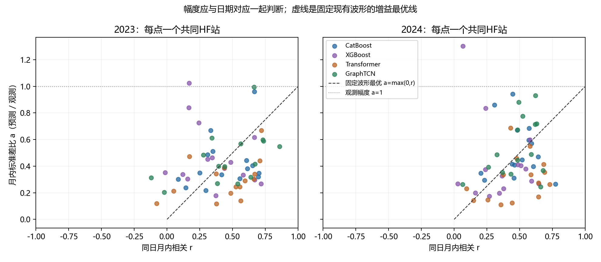

> 公开审阅副本：科学正文保留；大表链接指向完整分片，私有逐日曲线和旧实验链接标注为未公开。原报告与本副本哈希见发布清单。

# 振幅偏小的数值控制因子：日期对应、平方误差与共享参数约束

## 结论及其证据强度

本轮查明了**固定现有波形时，能够保留多少振幅的直接数值控制量是预测与观测在同日支持上的协方差／相关**。平方误差奖励同日对应的变化，也惩罚错误日期上的变化；相关较低时，降低变化强度可以降低损失。因此，幅度低于观测并不自动意味着代码中存在幅度上限，或把振幅提高就能改善NSE。

这项结论是严格的输出空间代数结果。它不能进一步唯一判定真实氮源、水量、旅行时间、正则或训练次数中的哪一项是物理主因。当前已经排除共同硬截幅和三种子平均作为全部低振幅的解释；已量化联合模型中的月水平／HF异常竞争；灰箱另有已证实的条件库存过滤。**不同模型表现相似，机制并不完全相同。**

11家直接日模型、两折共22组冻结结果，强行恢复单位幅度后，22组的逐站月内NSE总体中位数低于原预测。这里没有重新选点；所有改幅度结果均使用评价TN，属于标签辅助诊断，绝不能作为新预测成绩。

联合树三种子的底层种子未传递是本次实际发现的实现缺陷。已修正并在原8配置范围、原选择支持下重算。旧结果只读保留，不把重复结果作为三次随机稳定性证据。新的联合XGBoost内部选择为c3，从未依据2023／2024选择配置。

## 1．诊断支持、定义与复核

采用正式冻结预测与已认证站界。日／月水平与月内异常分别计算；月内按实际读数次数去均值，各月等权合并平方误差和观测方差。覆盖不足或观测方差为零保持不可定义，不加epsilon。核心表全部以逐站值求中位数；**不能把各列中位数代入公式推导中位NSE**。

对同站、同日、同权重的中心化观测y与预测p，定义a=σp/σy、r=Corr(y,p)、b=(均值p−均值y)/σy。直接分解：

\[
NSE=2ra-a^2-b^2.
\]

固定波形和均值，仅乘非负增益β：p′=均值p+β(p−均值p)。最优β=max(0,Cov(y,p)/Var(p))；最优幅度a*=max(0,r)；最优NSE=max(0,r)²−b²。强制a=1的NSE为2r−1−b²。若r>0，当前幅度每偏离r一段，损失增加(a−r)²；若r≤0，非负增益的最优点为0。预测常数时不强造相关或缩放。

这里β非负不等于所有变换后的日浓度非负。增益上界没有同时施加预测非负、共享参数可实现性和输入可预测性约束；因此只是当前波形的宽松诊断上界，不能作为合法模型性能。月内异常允许正负，与完整TN浓度的非负约束也不同。

计算由math.fsum独立标量矩、显式缩放回算和完整联合数据目标复算验证。合成正控为相位正确、幅度0.2，乘5后NSE=1；负控为90度错相、幅度1，强制单位幅度NSE=−1，最优正增益为0。正控说明诊断能够识别真正的幅度问题；负控说明幅度恢复不代表日期恢复。

## 2．多少误差确实能由幅度修复

以下是15个合格HF站的月内同支持诊断。原始日NSE、RMSE、偏差、相关、幅度及正式模型间配对表见[主专家报告](专家机器学习与全域验证报告.md)和[核心时间表](../outputs/expert_review/核心时间表.csv)。本表的最优增益是逐站利用评价标签计算的诊断上界，固定当前波形；不是整个模型结构的可达上界。

| 冻结配置 | 合格站 | 月内NSE | 月内RMSE mg/L | 月内偏差 mg/L | 幅度比 | 相关 | 固定波形最优幅度NSE | 强行幅度1的NSE | 逐站幅度增益中位数 |
| --- | --- | --- | --- | --- | --- | --- | --- | --- | --- |
| F23_daily_CatBoost_c4_seedmean | 15 | 0.16740 | 0.29570 | -0.00000 | 0.34999 | 0.41718 | 0.17404 | -0.16565 | 0.04724 |
| F24_daily_CatBoost_c4_seedmean | 15 | 0.20918 | 0.28421 | -0.00000 | 0.44775 | 0.48115 | 0.23151 | -0.03769 | 0.02135 |
| joint_F23_GraphTCN_c7_seedmean | 15 | 0.21569 | 0.30111 | 0.00000 | 0.41673 | 0.53790 | 0.28934 | 0.07581 | 0.05007 |
| joint_F23_Transformer_c3_seedmean | 15 | 0.18913 | 0.30227 | -0.00000 | 0.28937 | 0.52475 | 0.27536 | 0.04950 | 0.07800 |
| joint_F23_XGBoost_c3_seedmean | 15 | 0.10141 | 0.30191 | -0.00000 | 0.38414 | 0.34414 | 0.11844 | -0.31171 | 0.04769 |
| joint_F24_GraphTCN_c7_seedmean | 15 | 0.20977 | 0.24807 | 0.00000 | 0.48540 | 0.49190 | 0.24197 | -0.01620 | 0.02562 |
| joint_F24_Transformer_c3_seedmean | 15 | 0.18997 | 0.26883 | 0.00000 | 0.27387 | 0.47737 | 0.22788 | -0.04526 | 0.06301 |
| joint_F24_XGBoost_c3_seedmean | 15 | 0.12022 | 0.27014 | 0.00000 | 0.32704 | 0.36622 | 0.13412 | -0.26755 | 0.02140 |

每点为一站的同支持月内诊断，所有15站保留；虚线只描述固定波形的非负增益最优幅度。点在虚线上方时，沿当前波形进一步放大会升高误差；点在下方表示尚有标量幅度余量，仍不表示可修复日期。图中没有按成绩选择站点。

对应的两种配对汇总均列出，避免把总体中位数差当成逐站增益：

| 配置 | 共同站 | 总体NSE中位数差 | 逐站NSE差中位数 | 改善比例 |
| --- | --- | --- | --- | --- |
| F23_daily_CatBoost_c4_seedmean | 15 | 0.00664 | 0.04724 | 1.00000 |
| F24_daily_CatBoost_c4_seedmean | 15 | 0.02232 | 0.02135 | 1.00000 |
| joint_F23_XGBoost_c3_seedmean | 15 | 0.01703 | 0.04769 | 1.00000 |
| joint_F24_XGBoost_c3_seedmean | 15 | 0.01390 | 0.02140 | 1.00000 |
| joint_F23_Transformer_c3_seedmean | 15 | 0.08623 | 0.07800 | 1.00000 |
| joint_F24_Transformer_c3_seedmean | 15 | 0.03791 | 0.06301 | 1.00000 |
| joint_F23_GraphTCN_c7_seedmean | 15 | 0.07365 | 0.05007 | 1.00000 |
| joint_F24_GraphTCN_c7_seedmean | 15 | 0.03220 | 0.02562 | 1.00000 |

CatBoost月内相关约0.42／0.48，而原幅度约0.35／0.45，现有幅度已经接近对应波形的合理量级。将幅度强制拉至1会放大错日误差。Graph也具有类似关系，但2023还有更明显的标量幅度余量。最优缩放后的剩余归一误差只表示**固定波形不能被线性放大修复的部分**，不能说这些百分比就是“缺少输入信息”的贡献。

## 3．目标的哪一项限制振幅

真实联合数据目标为Jdata=0.4Σwm(官方月预测−月报)²+0.1Σwh[月内中心化(HF预测−HF观测)]²，来自0.8与0.2乘各自半平方误差。两项还各有训练期尺度和站／年／月平衡权重。不能只用0.8/0.2判断每个梯度的实际责任。

首先沿每个官方月均不变的方向v=p−该月等日均值，考察p(γ)=p+(γ−1)v。FP64核验Bv≈0，官方月数据项严格不变。**月水平项并不直接压制所有月内异常**。这只是输出空间方向，任意逐月方向不保证共享模型参数能够实现；负浓度数逐配置记录，负值profile不作合法候选。

再沿可由实际共享输出头或树margin缩放实现的方向检查：对softplus输出反解raw，对树使用log(p)，令raw′=均值raw+α(raw−均值raw)，再通过原正值链接。这同时改变空间差异、月份水平和日动态。其月项、HF项解析方向导数用三个步长复算；最后两个相邻步长分别满足1e−6(1+|g|)，不取误差最小值替代连续通过。

| 训练检查点 | 保持月均的HF最优增益 | 月数据项方向导数 | HF数据项方向导数 | 合计导数 | 两项相反 |
| --- | --- | --- | --- | --- | --- |
| joint_F23_XGBoost_c3_s1729 | 1.13396 | -0.05986 | -0.01506 | -0.07492 | False |
| joint_F23_XGBoost_c3_s1730 | 1.13413 | -0.05951 | -0.01513 | -0.07463 | False |
| joint_F23_XGBoost_c3_s1731 | 1.13463 | -0.06089 | -0.01515 | -0.07604 | False |
| joint_F23_Transformer_c3_s1729 | 1.60464 | -0.21117 | -0.01022 | -0.22139 | False |
| joint_F23_Transformer_c3_s1730 | 1.39594 | 0.13431 | -0.00937 | 0.12494 | True |
| joint_F23_Transformer_c3_s1731 | 1.09044 | 0.46468 | -0.00270 | 0.46198 | True |
| joint_F23_GraphTCN_c7_s1729 | 0.97161 | 0.00045 | 0.00200 | 0.00244 | False |
| joint_F23_GraphTCN_c7_s1730 | 0.90962 | -0.08963 | 0.00737 | -0.08226 | True |
| joint_F23_GraphTCN_c7_s1731 | 1.05829 | 0.02748 | -0.00430 | 0.02318 | True |
| joint_F24_XGBoost_c3_s1729 | 1.18034 | -0.06814 | -0.02148 | -0.08961 | False |
| joint_F24_XGBoost_c3_s1730 | 1.18138 | -0.06845 | -0.02155 | -0.09000 | False |
| joint_F24_XGBoost_c3_s1731 | 1.18292 | -0.06753 | -0.02161 | -0.08914 | False |
| joint_F24_Transformer_c3_s1729 | 1.27792 | 0.26987 | -0.00769 | 0.26218 | True |
| joint_F24_Transformer_c3_s1730 | 1.41980 | -0.06473 | -0.01054 | -0.07527 | False |
| joint_F24_Transformer_c3_s1731 | 1.32505 | 0.56275 | -0.00838 | 0.55437 | True |
| joint_F24_GraphTCN_c7_s1729 | 1.00476 | -0.05821 | 0.00034 | -0.05787 | True |
| joint_F24_GraphTCN_c7_s1730 | 1.03141 | -0.08065 | -0.00187 | -0.08251 | False |
| joint_F24_GraphTCN_c7_s1731 | 1.05897 | -0.02407 | -0.00348 | -0.02756 | False |

18个实际联合训练检查点中7个方向上两数据块相反，其中5个是月项压制该共享增益、HF项希望增大。F24 Transformer seed1729月导数约+0.26987、HF约−0.00769；两者不是等量竞争。α从1到1.25时月项从约0.30264升至0.44628，HF项由约0.05472降至0.05359，数据总目标反而上升。这是共享参数耦合的实证，不能外推成所有模型都被月项限制。

Graph的保持月均方向在训练期最优γ约0.91—1.06，训练波形已接近该标量方向最优；盲目放大增加HF误差。其他模型还有幅度余量，但不能只沿此一方向恢复日期对应。上述导数不包含AdamW／树叶正则，因此非零数据导数不能自动判定总目标未收敛，更不能判定伴随错误。有限迭代、表达不足与正则效应仍需控制比较才能拆开。

## 4．排除共同硬限制；量化种子平均

60个注册读出中零预测总数为0，检查支持预测范围约0.30669—16.74205mg/L。直接路线的非负截断未在这些输出上激活。softplus没有上限，其实际18个训练profile中神经链接导数最小值为0.27099，没有接近0饱和。树exp的绝对margin风险门用于拒绝异常，不是裁剪浓度振幅。特征标准化作用于X，没有共同把TN标签乘0.5的步骤。这些排除结论限于已检查支持，不认证所有未见输入。

三种子平均采用精确方差恒等式：父模型方差均值=均值预测方差+种子分歧方差。报告标准差保留比例，而非把它直接当作观测振幅比：

| 配置 | 平均后标准差保留比例 |
| --- | --- |
| F23_daily_CatBoost_c4_seedmean | 0.93555 |
| F24_daily_CatBoost_c4_seedmean | 0.96380 |
| joint_F23_GraphTCN_c7_seedmean | 0.84539 |
| joint_F23_Transformer_c3_seedmean | 0.92127 |
| joint_F23_XGBoost_c3_seedmean | 0.96784 |
| joint_F24_GraphTCN_c7_seedmean | 0.93306 |
| joint_F24_Transformer_c3_seedmean | 0.93070 |
| joint_F24_XGBoost_c3_seedmean | 0.96472 |

CatBoost约损失3.6%—6.4%标准差，Graph约6.7%—15.5%；单种子本来已经低振幅，因此平均是次要平滑。原XGBoost比例1源于同一底层种子，已不作为有效随机稳定性证据；修正后比例见上表。随机种子修复是程序修正，不是放宽幅度门或按评价成绩更改训练目标。

## 5．为什么灰箱、树与神经网络都出现低振幅

先核对模型在训练支持能否表达动态。下表与前述留出表分开，不能跨日期作配对增益；它是训练重建，不是预测成绩：

| 配置 | 训练合格站 | 训练日NSE | 训练月内NSE | 训练月内相关 | 训练月内幅度 |
| --- | --- | --- | --- | --- | --- |
| F23_daily_CatBoost_c4_seedmean | 15 | 0.83494 | 0.67073 | 0.87913 | 0.57340 |
| F24_daily_CatBoost_c4_seedmean | 15 | 0.88408 | 0.70916 | 0.87264 | 0.62949 |
| joint_F23_XGBoost_c3_seedmean | 15 | -0.56318 | 0.93366 | 0.97780 | 0.84861 |
| joint_F24_XGBoost_c3_seedmean | 15 | -0.41254 | 0.89731 | 0.96067 | 0.80395 |
| joint_F23_Transformer_c3_seedmean | 15 | 0.23126 | 0.27104 | 0.58640 | 0.31605 |
| joint_F24_Transformer_c3_seedmean | 15 | 0.47991 | 0.32517 | 0.61391 | 0.37498 |
| joint_F23_GraphTCN_c7_seedmean | 15 | 0.46393 | 0.61783 | 0.83118 | 0.61211 |
| joint_F24_GraphTCN_c7_seedmean | 15 | 0.63287 | 0.56921 | 0.77143 | 0.61887 |

高训练相关／幅度与较弱留出相关／幅度并存，表明这些模型并非从代码上不能输出较强动态。若某条联合模型训练期也弱，须进一步检查块间竞争、有限训练与表达；不能用其他模型的高训练NSE认证它已经充分求解。两种日期人口不同，跨期总体中位数差、逐站配对差和改善比例在此为不适用。

特别区分联合树的绝对日水平和月内动态：修正后的c3三种子训练日NSE约−0.563／−0.413，但训练月内NSE约0.934／0.897。这不是“振幅完全提不起来”；联合目标约束官方月水平和HF异常，**不直接约束第二份HF绝对月均**。其训练残差包含背景／观测支持不相容问题。不能把负日NSE全部归到日动态，亦不能为了消除负值而把同站月两份水平标签重复计权。数值见上表与完整训练逐站结果。

**灰箱有独立的传递衰减证据。** [24-1逐层审计](../docs/PRIVATE_ARTIFACTS.md)在固定H1、参数、合成需求与历史下，源脉冲／平滑标准差比约50，局地快输出只剩约1.018／1.022、到站浓度约1.036／1.029。单位输入一年后约65%留在M/L、约7%—8%离开陆地、约27%记为有效损失。它证明该条件下陆地库存是强过滤层；不能说现实氮恰好按这些份额分配。

[24-2输入审计](../docs/PRIVATE_ARTIFACTS.md)指出年度资料、旧年份替代和长期作物日历不提供真实事件源日期；共同M池摄取不能代表所有地类植物活动。后续LAND1已拆语义与土地预算，但SON／可用池／慢水仍可能过滤，骨架测试不等于真实事件已恢复。[综合复盘](../docs/PRIVATE_ARTIFACTS.md)也已证明快库能明显改变输出，却常把变化推向错误日期；仅更快不是充分解释。

**纯ML没有M/L库存递推，仍低振幅，说明库存不是两类模型共有的唯一原因。** 树叶均值与平方误差回归、序列模型的共享函数都趋向在现有X下可重复的条件均值。如果同类驱动对应的观测事件不稳定，条件均值就比观测平滑。这是平方损失的数学性质，不是本项目已证明某一缺失特征的因果贡献。本轮没有发现可认证的精确特征碰撞下界，不能把相关较低全部解释成不可约噪声。

其数学来源可进一步写清：总体平方损失的理想预测μ(X)=E[Y|X]满足Var(Y)=Var(μ)+E[Var(Y|X)]，以及Cov(Y,μ)=Var(μ)。因此理想条件均值的幅度比a=√[Var(μ)/Var(Y)]≤1、相关r=a。只要给定当前驱动后还有未解析变化，即使优化和代码都正确，最优平方误差预测也会低于观测方差。**这里的条件分布不是本项目已估计出来的真实分布**；这条定理解释共有机制，不提供真实不可约误差数值，也不能用评价相关反推出缺失源的质量份额。

两类模型共同依赖冻结H1、较粗农业／来源活动和同一日／月读出；源日期、正确水载体、站界水量及日内变幅都可能限制同日协方差。纯ML不经过灰箱库存，因此它的共同症状提高了检查共享驱动和观测支持的优先级，不能仅凭症状宣判H1错误。Graph输入还多一跳河网视图，跨算法差值不是严格等信息量的表达能力因果实验。

历史TN辅助能改善部分时间预测，表明近期TN状态包含外部驱动主线未捕获的可用预测信息；但它改变任务可见性，不能反过来证明是哪种排放或水文过程缺失。2023的一日持续性还强于学习路线，2024学习路线相对持续性的逐站NSE差中位数约+0.06744；不是普遍胜出。未见支流可能幅度约1仍为负NSE，例如B56 Graph2024，这直接反驳“幅度恢复就解决迁移”的判断。

## 6．目前找到的最终控制因子，以及仍不能认证的项

| 层次 | 已识别控制量 | 当前结论 | 证据边界 |
|---|---|---|---|
| 固定输出波形 | 同日加权Cov(y,p)／相关r | 正增益最优a*=max(0,r)；不是a*=1 | 严格代数，对固定波形有效 |
| 联合模型共享参数 | 月水平与HF项方向导数、实际尺度权重 | 部分检查点月项压制可行共享增益 | 方向级数据项证据，非所有参数／总正则目标 |
| 灰箱过程 | M/L保留、损失和水文释放 | 冻结条件下强库存过滤 | 合成过程响应，不是实测贡献 |
| 预测信息 | 源活动日期、水载体、观测支持、状态信息 | 是跨模型共同优先疑点 | 尚缺独立对照，不能指定唯一物理主因 |
| 软件 | 联合树seed漏传 | 已实际修正并原矩阵重算 | 影响随机稳定性证据，不解释所有低振幅 |

因此，对“到底是哪一项约束振幅”的直接回答是：**现有波形受同日协方差约束；联合模型还受共享参数上的数据块竞争；灰箱另受库存过滤。尚无证据把全部模型归结为一个相同的物理控制因子。**

## 7．针对性修正与下一轮优先级

本轮已修seed传递、恒定HF月均的末位假波动、FP32诊断均值的精度问题；原筛选范围、输入、标签支持和非负约束不变。没有为了把幅度拉高而加评价期增益、改HF权重或重复月标签。该取舍符合本次冻结设计，修正后所有正式指标重新计算。

下一阶段首先在合法内部验证上检验“月水平头＋严格零月均异常头”的可实现分解，仍由同一独立驱动预测异常、不读取评价TN；沿同支持比较NSE、相关、峰日和月水平，判断是否减少共享头竞争。然后以固定输入／初始化／训练预算做正则与有效训练量的小型对照，确认剩余幅度余量是优化还是表达。最后用独立活动源日期和同站界水量做替换对照，灰箱用等质量层间脉冲检查M/L出口日期及水载体；不能同时改多项再称某项原因。

优先级针对当前证据，未在本轮增加新科学网格。成功标准为月内NSE、相关、共同日期峰日和月水平同时支持，不能只以幅度比接近1签发修复。

## 可复算文件

- [逐站幅度—相关—增益](../outputs/amplitude_diagnostic/station_shape_gain_profiles/INDEX.md)、[汇总](../outputs/amplitude_diagnostic/shape_gain_summary.csv)
- [18检查点方向导数](../outputs/amplitude_diagnostic/joint_training_amplitude_directions.csv)、[实际目标profile](../outputs/amplitude_diagnostic/joint_training_amplitude_profiles.csv)
- [种子平均方差分解](../outputs/amplitude_diagnostic/seed_averaging_variance.csv)、[非负门活动](../outputs/amplitude_diagnostic/output_range_and_zero_activity.csv)
- [专项数值回执](../outputs/amplitude_diagnostic/receipt.json)、[种子修复回执](../evidence/joint_seed_repair.json)、[实际方法与偏离](实际方法与偏离.md)

复算命令：sparrow环境中运行`python -B diagnose_amplitude.py`，随后`python -B author_amplitude_report.py`。两者均不拟合、不选点。科学训练已冻结，标签辅助profile不能写回正式预测。报告由本任务根据可核证据完成，不冒称外部人类同行评审。
